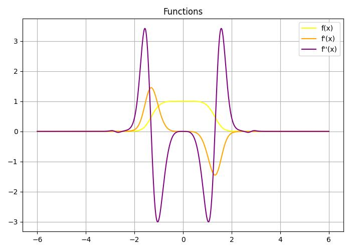

# analyzefunction
The file `analyzefonction.py` is a Python program that allows you to visualize a mathematical function along with its first and second derivatives. You can select from a few predefined functions and specify the interval and number of points for plotting.

Features:
-	Predefined test cases with:
    - 	Original function `f(x)`
    - 	First derivative `f′(x)`
    - 	Second derivative `f′′(x)`
-	Dynamic interval input for plotting
-	Input validation
-	Visualization using matplotlib

Requirements:
-	Python 3.x
-	NumPy
-	Matplotlib

How to Use:
1.	Run the script.
2.	Choose one of the test cases (1, 2, or 3) when prompted.
3.	Enter the start and end of the interval you want to analyze.
4.	Specify how many points to generate on the graph.
5.	View the graph showing:
    - `f(x)` in yellow
    - `f′(x)` in orange
    - `f′′(x)` in purple
6.	Choose whether to continue testing with another function or exit the program.

Test Functions Overview:

Test 1:

- f(x) is `np.exp(np.sin(x**2)) / np.exp(x**2)`

Test 2:

- f(x) is `np.exp(np.cos(x**2)) / np.exp(x**2)`

Test 3:

- f(x) is `np.exp(np.sin(x)) / np.exp(x)`

Each test includes corresponding first and second derivatives.

Example:

- What test to choose: 1, 2 or 3? `1`
- Enter interval start point: `-2`
- Enter interval end point: `2`
- Enter number of points: `100`

A graph with the function and its derivatives will be shown.

Why Use This:

This is a great tool for:
-	Visualizing how functions and their derivatives behave
-	Learning and teaching calculus
-	Experimenting with mathematical expressions

Note:
The function expressions are evaluated using `eval()`. Make sure you trust the input code or keep it to safe predefined formulas.

